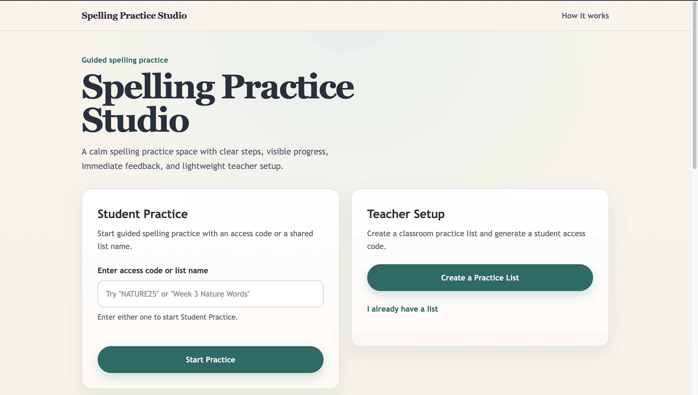
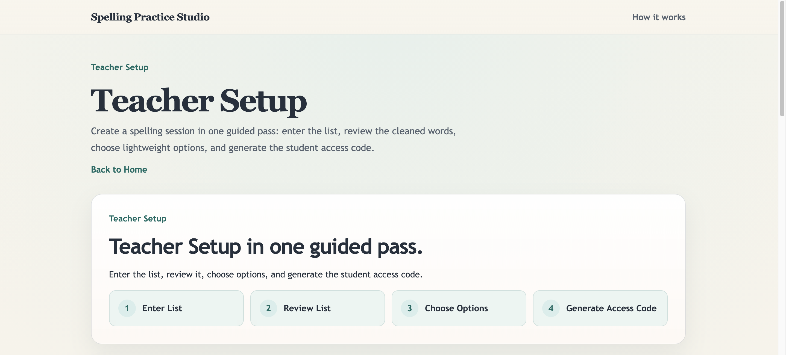
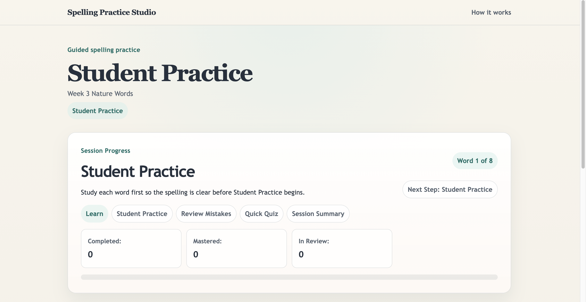

# Spelling Practice Studio

## Overview
Spelling Practice Studio is a university Human-Computer Interaction redesign project. It rethinks a spelling-learning website as a calmer, more guided, and more classroom-friendly experience for both teachers and students.

This repository contains a front-end prototype built with Vite, React, and TypeScript. The current implementation is organized around a guided spelling-practice flow centered on:

- Teacher Setup
- Student Practice
- Immediate feedback
- Review Mistakes
- Quick Quiz
- Teacher Summary

The prototype is intentionally lightweight. It focuses on interaction design, clarity, and learnability rather than backend systems or production deployment.

## Problem With the Original Experience
The original spelling experience was more fragmented and harder to interpret quickly. In classroom use, that creates several usability problems:

- teacher and student entry points are not as clear as they could be
- the next step in the learning flow is not always obvious
- feedback can feel disconnected from progress and review
- review and follow-up are harder to scan at a glance
- the interface places more cognitive load on first-time users

This redesign aims to replace that fragmented experience with a more guided interaction flow that is easier to learn, easier to scan, and easier to explain in a classroom setting.

## Redesign Goals
- Make teacher and student entry points easy to identify.
- Support one clear action at a time during setup and practice.
- Keep progress, review state, and next steps visible throughout the flow.
- Provide immediate, readable feedback after student responses.
- Reduce clutter and keep the experience classroom-friendly.
- Preserve a lightweight prototype scope without backend complexity.

## HCI Principles Used in the Redesign
- **Visibility:** session progress, review state, and next steps are surfaced clearly.
- **Feedback:** student answers receive immediate, interpretable responses.
- **Consistency:** shared terminology, controls, layout patterns, and hierarchy are reused across pages.
- **Cognitive load reduction:** the interface emphasizes the current task instead of many competing controls.
- **Learnability:** the flow is structured so a new user can understand what to do without guesswork.
- **Guided interaction flow:** the product reinforces a clear sequence of setup, practice, review, quiz, and summary.

## Screenshot Placeholders

### Homepage


*Placeholder: the homepage should show the split entry points for Student Practice and Teacher Setup, plus the guided practice loop.*

### Teacher Setup


*Placeholder: this screenshot should show the spelling-list entry area, cleaned review list, lightweight options, and Generate Access Code action.*

### Student Practice


*Placeholder: this screenshot should show the main Student Practice screen with the prompt, answer input, and visible Session Progress area.*

### Incorrect Answer Feedback


*Placeholder: this screenshot should show an incorrect response with immediate feedback, the correct spelling, Added to Review messaging, and the next step.*

### Teacher Summary


*Placeholder: this screenshot should show the Teacher Summary with session outcome, words practiced, mastered words, words in review, and most missed words.*

## Current Implemented Features

### Homepage
- Clear separation between `Student Practice` and `Teacher Setup`
- Student entry using an access code or list name
- Teacher entry for creating a classroom practice list
- Visible guided loop: `Learn -> Student Practice -> Review Mistakes -> Quick Quiz`

### Teacher Setup
- Session/list naming and optional teacher name
- Paste-first spelling list entry
- Automatic trimming, duplicate removal, and blank-line cleanup
- Review List with per-word removal
- Lightweight setup options for starting mode and hint support
- Local mock access-code generation
- Success state with session summary and mock share link

### Student Practice Flow
- Guided multi-stage flow:
  - Learn
  - Student Practice
  - Review Mistakes
  - Quick Quiz
  - Session Summary
- One-word-at-a-time practice with visible Session Progress
- Immediate correct / incorrect feedback
- Review-state updates for missed words
- Summary state with mastered count, words in review, and next-step guidance

### Review / Quiz / Summary
- Review stage for missed words
- Quick Quiz stage after practice and review
- Session Summary state with completion messaging and recommended next steps

### Teacher Summary
- Lightweight teacher-facing summary of completed sessions
- Session outcome messaging
- Counts for:
  - Words Practiced
  - Mastered Words
  - Words in Review
- Ranked `Most Missed Words` section

### Final Consistency and HCI Polish Pass
- Standardized terminology across homepage, teacher setup, student practice, summary, and teacher summary
- Clearer stage headings and next-step wording
- Stronger visual hierarchy cues without changing the architecture

## Tech Stack
- Vite
- React
- TypeScript
- React Router
- CSS
- Browser `localStorage` for prototype-only persistence

## Project Structure Overview

```text
src/
├── app/
│   ├── App.tsx
│   └── routes.tsx
├── components/
│   ├── layout/
│   │   ├── Header.tsx
│   │   └── PageShell.tsx
│   └── ui/
│       ├── Button.tsx
│       ├── Card.tsx
│       └── Input.tsx
├── data/
│   └── mockLists.ts
├── pages/
│   ├── HomePage/
│   ├── TeacherSetupPage/
│   └── StudentSessionPage/
├── styles/
│   ├── global.css
│   └── tokens.css
├── types/
│   └── spelling.ts
├── utils/
│   ├── listParsing.ts
│   ├── practiceStorage.ts
│   └── validation.ts
└── main.tsx
```

## Local Setup
### Prerequisites
- Node.js 18+ recommended
- npm

### Install
```bash
npm install
```

## Run and Build
### Start the development server
```bash
npm run dev
```

### Create a production build
```bash
npm run build
```

### Preview the production build
```bash
npm run preview
```

## Implemented vs Future Work

### Implemented in this prototype
- Homepage and routing foundation
- Teacher Setup flow
- Student Practice flow with review, quiz, and summary
- Teacher Summary view
- Shared UI/layout system and final consistency polish

### Possible future work
- Stronger persistence beyond the current browser
- Additional teacher-facing summary detail
- User testing-driven refinements to wording and interaction flow
- Expansion of the prototype into a fuller classroom deployment model

## Project Scope and Prototype Limitations
This repository is a front-end HCI prototype, not a production system. It intentionally does **not** include:

- authentication
- a backend API
- a database
- live multi-user synchronization
- analytics dashboards
- grading or roster-management features

All current list/session behavior is prototype-level and browser-local. The goal of this implementation is to demonstrate and evaluate the redesigned interaction flow, not to provide a complete deployed platform.
